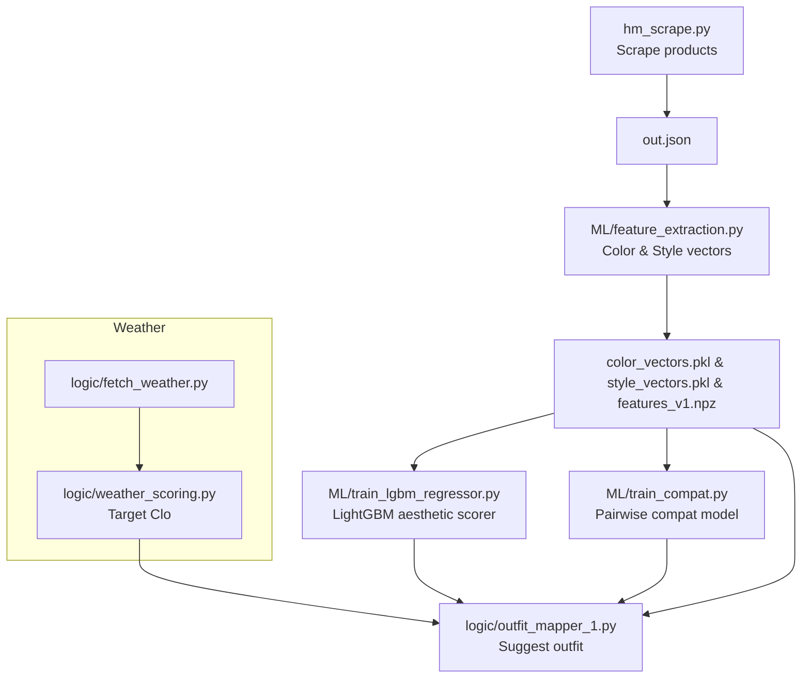

# Style2 – Fashion Data Pipeline & Weather-Aware Outfit Engine

> Scrape ➜ Enrich ➜ Embed ➜ Recommend

Style2 is an end-to-end, _Python-only_ toolkit that:

1. **Scrapes** detailed, structured product data from public fashion e-commerce pages (currently H&M).
2. **Extracts** rich text-based features – _colors_ (CIE Lab) & _style embeddings_ (Sentence-BERT) – from the scraped data.
3. **Models** clothing thermal properties from fabric composition and **maps weather → target clothing insulation (Clo)**.
4. **Builds** complete, clash-free outfits (top, bottom, ± outer layer) that hit the target Clo while respecting garment roles.

The repository is organised as a collection of _independent but chain-able_ modules so you can plug only the parts you need.

### Pipeline overview



1. **Scrape** → `hm_scrape.py` saves raw product JSON (`out.json`).
2. **Embed** → `ML/feature_extraction.py` converts JSON into color & style vectors (`*.pkl`, `features_v1.npz`).
3. **Model** (optional) – train ML components:
   * `ML/train_lgbm_regressor.py` → `aesthetic_scorer_v1.pkl`
   * `ML/train_compat.py`        → `compat_model.joblib`
4. **Weather** → `logic/fetch_weather.py` + `logic/weather_scoring.py` map live conditions to a **target Clo**.
5. **Recommend** → `logic/outfit_mapper_1.py` combines vectors, ML scorers & weather target to build a complete outfit.

---

## Repository layout

```text
style2/
├─ hm_scrape.py               # Selenium-based single/batch scraper (JSON out)
├─ hm_scrape_waits.py         # Variant with extra fixed waits between page loads
├─ scraper_batch.py           # Tiny wrapper to launch many concurrent scrapes
├─ dataset_ayk/               # Label cleaning & annotation helpers
│  ├─ csv_data_cleaning.py
│  ├─ add_item_types.py
│  ├─ annotate_pair_type.py
│  ├─ dedupe_validate_labels.py
│  └─ make_clean_from_roles.py
├─ ML/
│  ├─ feature_extraction.py   # Color + style & other feature generator
│  ├─ build_features_with_pairtype.py  # Pair-aware feature bundle builder
│  ├─ feature_engineering.py  # Extra utilities for tabular ML
│  ├─ cli_labeling.py         # TUI for fast pairwise label annotation
│  ├─ train_compat.py         # Outfit compatibility model trainer
│  ├─ train_lgbm_regressor.py # Thermal Clo regressor (experimental)
│  ├─ color_vectors.pkl       # {item_id: [L,a,b]}
│  ├─ style_vectors.pkl       # {item_id: 384-d embedding}
│  └─ features_v1.npz         # Bundled arrays (ids, Lab, Sty)
├─ logic/
│  ├─ fetch_weather.py        # Meteoblue API wrapper
│  ├─ weather_scoring.py      # Fabric→Clo & weather→target Clo maths
│  ├─ outfit_mapper.py        # Simple rule-based outfit builder (baseline)
│  ├─ outfit_mapper_1.py      # Advanced outfit builder (thermal + aesthetic, default)
│  └─ run_batch_tests.py      # Regression & demo harness
└─ README.md                  # ← you are here
```

---

## 1. Web scraping  (`hm_scrape.py`)

A **headless-Chrome Selenium** scraper that extracts product metadata from H&M product pages.  
It merges multiple sources (JSON-LD, Next.js `__NEXT_DATA__`, DOM) to build a resilient schema.

### Key fields
`item_id`, `name`, `type` (category), `color`, `gender`, `fabric_composition`, `description`, flattened `key_value_description`, `productImage`.

### Usage
```bash
# interactive (one product)
python hm_scrape.py -o out.json

# batch (many products)
python hm_scrape.py -i url.txt -o out.json
```
See the original scraper section below for advanced options & troubleshooting.

---

## 2. Feature extraction  (`ML/feature_extraction.py`)

Converts the raw JSON output of the scraper into numerical features:

• **Color vectors** – best-guess base color in CIE Lab (shape 3)  
• **Style vectors** – 384-dim Sentence-BERT embeddings of the name + description

Outputs three files by default:

| File | Shape | Description |
|------|-------|-------------|
| `color_vectors.pkl` | dict[item_id] → \[L,a,b] | Compact Python pickle |
| `style_vectors.pkl` | dict[item_id] → 384-d | ‑//- |
| `features_v1.npz`   | ids, Lab, Sty | NumPy compressed bundle |

```bash
python ML/feature_extraction.py --input out.json \
       --colors color_vectors.pkl \
       --styles style_vectors.pkl \
       --bundle features_v1.npz
```

Sentence-BERT (all-MiniLM-L6-v2) is loaded via `sentence-transformers`; GPU is used if `CUDA_VISIBLE_DEVICES` is set.

---

## 3. Thermal modelling  (`logic/weather_scoring.py`)

`weather_scoring.py` turns _fabric composition strings_ into **intrinsic thermal resistance (Clo) & breathability (RET)** estimates, then adjusts for garment coverage.

It also provides helper functions to:

1. Convert weather inputs (temp, RH, wind, sun, rain) → **apparent temperature**
2. Map apparent temperature → **target Clo** via piece-wise linear interpolation with modifiers for sun, rain, activity, wind exposure.

These scores are completely rule-based and do **not** require ML.

---

## 4. Outfit generation  (`logic/outfit_mapper_1.py` – default)

Given:

* current weather (or a `target_clo` directly), and
* a catalogue of previously scored garments (Clo, RET, type, role)

The **`outfit_mapper_1`** engine supersedes the simpler `outfit_mapper.py` by:

* Seamlessly enriching sparse items with cached vectors/metadata from `ML/features_v1.npz`.
* Integrating a _LightGBM_-based **Aesthetic Scorer** that rates the visual harmony of the assembled outfit.  
  * The regressor is trained via `ML/train_lgbm_regressor.py` on a 771-dim feature space that concatenates style & colour embeddings plus pairwise cosine similarities.
  * The resulting model is stored as `ML/aesthetic_scorer_v1.pkl` and auto-loaded at runtime. When the file is missing it falls back to a lightweight heuristic.
* Relaxing thermal constraints when Clo estimates are missing so that a suggestion is _always_ produced.

> If you still need the purely rule-based behaviour you can import `logic.outfit_mapper` explicitly.

Run a self-contained demo:
```bash
python -m logic.outfit_mapper_1 --demo
```

---

## 5. Batch test harness  (`logic/run_batch_tests.py`)

A tiny script that stress-tests the outfit mapper across a weather grid and prints summary stats. Useful for sanity checks when you tweak scoring rules.

---

## 6. Data labelling helpers  (`dataset_ayk/` & `ML/cli_labeling.py`)

A suite of scripts to clean raw crowdsourced judgments, validate consistency, and interactively annotate garment pairs.

• `dataset_ayk/csv_data_cleaning.py` – general column normaliser  
• `dataset_ayk/add_item_types.py` – map product categories → high-level garment roles  
• `dataset_ayk/annotate_pair_type.py` – label **pair-types** (e.g. *top–bottom*, *outer–anything*)  
• `dataset_ayk/dedupe_validate_labels.py` – fuzzy-match duplicates and surface conflicts  
• `dataset_ayk/make_clean_from_roles.py` – final tidy export

For quick manual annotation use the text-based UI:

```bash
python ML/cli_labeling.py --csv dataset_ayk/ground_truth_labels_cleaned.csv
```

---

## 7. Aesthetic compatibility model (LightGBM)  (`ML/train_lgbm_regressor.py`)

`train_lgbm_regressor.py` fits a **LightGBM** gradient-boosted regressor that scores the _visual harmony_ of a (top, bottom, ±outer) outfit on a 1–5 scale.

Pipeline recap:

1. Run `ML/feature_extraction.py` to obtain `features_v1.npz` (style + colour vectors).
2. Build the 771-dim outfit feature matrix from the vectors and pairwise sims (see code comments).
3. Launch training:

```bash
python ML/train_lgbm_regressor.py \
       --data training_data.npz \
       --out ML/aesthetic_scorer_v1.pkl
```

At runtime `logic.outfit_mapper_1` checks for `ML/aesthetic_scorer_v1.pkl` and loads it automatically. If the file is absent it falls back to a rule-of-thumb score so the pipeline keeps working.

---

## 8. Pair-type feature builder  (`ML/build_features_with_pairtype.py`)

Generates an extended `features_pairtype.npz` bundle that augments the base vectors with categorical **pair-type** one-hots so that the compatibility model can learn type-specific interactions.

Run:

```bash
python ML/build_features_with_pairtype.py --input out.json
```

---

## End-to-end pipeline example

```bash
# 0) create & activate virtualenv
python3 -m venv .venv && source .venv/bin/activate && pip install -U pip

# 1) install deps (minimal)
pip install selenium sentence-transformers numpy matplotlib scikit-image tqdm

# 2) scrape a few items
python hm_scrape.py -i url.txt -o out.json

# 3) extract features
python ML/feature_extraction.py --input out.json

# 4) generate outfit suggestion for a location
python - <<'PY'
from logic.outfit_mapper_1 import suggest_outfit
from logic.weather_scoring import get_meteoblue_current

items_file = 'ML/features_v1.npz'  # or load your DB
w = get_meteoblue_current('Berlin,DE')
outfit = suggest_outfit(w, items_file)
print(outfit)
PY
```

---

## Installation & Requirements

* **Python 3.9+** (works on 3.11)
* Google **Chrome** (the scraper uses Selenium 4.10+ with built-in driver manager)
* pip packages _(see `requirements-rough.txt`)_:
  * selenium
  * sentence-transformers
  * numpy, matplotlib, scikit-image, tqdm

> ⚠️ GPU is optional – the feature extractor falls back to CPU.

---

## Contributing

Pull requests are welcome!  
Ideas: support more retailers, add image-based features, train a learned Clo predictor.

---

## License

Currently no explicit license. Open an issue if you need clarification.

### Additional top-level assets

* `out.json` — Latest multi-product scrape example (same schema as scraper output).
* `color_vectors.json` / `color_vectors.pkl` — Human-readable & pickle versions of color vectors.
* `example.html`, `multi-color-example.html` — Stand-alone demos that visualise colour extraction.
* `previous_outs/` — Time-stamped JSON dumps kept for regression comparison.

These are safe to delete; the pipeline always regenerates them.

---

### Alternative scraper variant  (`hm_scrape_waits.py`)

If you experience race conditions (elements not yet present), use the **explicit-wait flavour**:

```bash
python hm_scrape_waits.py -i url.txt -o out.json --sleep 3  # adds fixed sleep between page loads
```

Both scraper variants share the same CLI but differ in internal wait strategy:

| Script | Wait model | When to use |
|--------|------------|-------------|
| `hm_scrape.py` | WebDriverWait + JS readiness (fast, dynamic) | default |
| `hm_scrape_waits.py` | extra fixed sleeps after navigation | flaky networks / heavy pages |

---

### HTML colour demo files

Run the colour extractor on `multi-color-example.html`:

```bash
python - <<'PY'
from pathlib import Path, PurePath
from ML.feature_extraction import _candidate_list, _apply_aliases
html = Path('multi-color-example.html').read_text()
for token in sorted(set(_candidate_list(html))):
    print(token)
PY
```

---

### Known limitations

* Only English fabric strings are parsed; add translations in `FABRIC_ALIASES` if you scrape other locales.
* Clo targets are calibrated on light activity — adjust `activity` argument for sport use-cases.
* Style embeddings are textual; garments with sparse descriptions get weak vectors.

---

### Project roadmap

1. **Multi-retailer support** — Zara & Uniqlo JSON schemas are partly compatible.
2. **Image embeddings** — CLIP features to improve style similarity search.
3. **Feedback loop** — Fine-tune target Clo mapping using user “too hot/cold” feedback.

---
